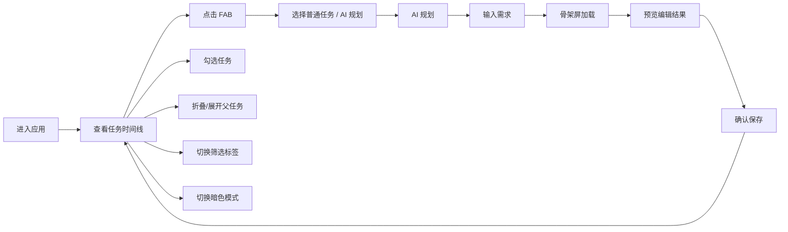

# TaskFlow 预览版 · 产品需求文档

## 1. 产品概述

TaskFlow 是一款离线优先、AI 辅助的轻量级个人任务管理工具。本项目为 Web 预览原型，用于展示 V1.3 设计方案的核心界面效果与交互体验。

- **核心定位**：极简、高效、可控
- **目标用户**：需要 AI 辅助任务管理需求的个人用户
- **预览价值**：直观感受设计方案，验证 UI/UX 效果

## 2. 核心功能

### 2.1 功能模块

1. **主界面**：顶部导航、搜索、筛选标签、任务时间线列表、FAB 悬浮按钮
2. **任务列表**：时间线分组（今天/明天/本周/更晚）、父子任务折叠展开、进度条
3. **任务操作**：勾选完成、左滑删除、右滑标记、多选批量操作
4. **AI 规划**：AI 生成弹窗、预览编辑、骨架屏加载效果
5. **主题切换**：亮色/暗色模式一键切换

### 2.2 页面详情

| 页面名称 | 模块名称 | 功能描述 |
|---------|---------|---------|
| 主界面 | 顶部导航 | 应用标题、搜索图标、主题切换、设置入口 |
| 主界面 | 筛选标签 | 今日/明日/本周/全部 快速切换 |
| 主界面 | 任务列表 | 时间线分组、卡片式布局、优先级色条 |
| 主界面 | 父子任务 | 折叠/展开动画、进度条、子任务缩进 |
| 主界面 | FAB 按钮 | 右下角悬浮按钮、点击展开选项 |
| AI 弹窗 | 生成表单 | 任务标题、描述、截止日期输入 |
| AI 弹窗 | 预览列表 | AI 生成结果可编辑、可勾选 |
| 全局 | 暗色模式 | 一键切换、平滑过渡动画 |

## 3. 核心流程

## 4. 用户界面设计

### 4.1 设计风格

- **主色调**：墨绿 #2e7d32，传递沉稳高效
- **优先级色**：紧急红 #d32f2f、普通黄 #f9a825、低优蓝 #42a5f5
- **卡片圆角**：16px，极淡阴影，层次分明
- **字体**：现代无衬线字体，清晰易读
- **动效**：弹性缓动曲线，细腻流畅
- **布局**：顶部导航 + 内容列表 + 悬浮按钮，无底部栏

### 4.2 页面设计概览

| 页面名称 | 模块名称 | UI 元素 |
|---------|---------|---------|
| 主界面 | 顶部导航 | 左对齐标题、右侧搜索/主题/设置图标 |
| 主界面 | 筛选标签 | 横向滚动、选中态高亮底色 |
| 主界面 | 任务分组 | 分组标题、任务计数、时间线分布 |
| 主界面 | 任务卡片 | 优先级色条、复选框、标题、日期、展开箭头 |
| 主界面 | 子任务 | 缩进布局、连接线、进度条 |
| 主界面 | FAB | 圆形悬浮、点击缩放、展开菜单 |
| AI 弹窗 | 表单 | 输入框、生成按钮、加载动画 |
| AI 弹窗 | 预览 | 可编辑列表、确认取消按钮 |

### 4.3 响应式

- 桌面端：最大宽度 480px 居中展示，模拟手机端效果
- 移动端：全屏自适应
- 触控优化：44px 最小点击热区
