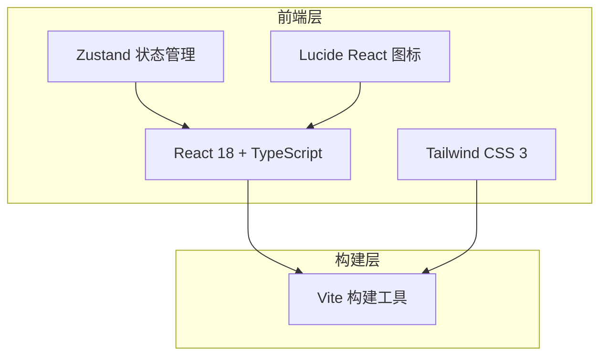

# TaskFlow 预览版 · 技术架构文档

## 1. 架构设计



## 2. 技术描述

- **前端**：React 18 + TypeScript + Vite
- **样式**：Tailwind CSS 3 + CSS 变量（主题系统）
- **状态管理**：Zustand
- **图标**：lucide-react
- **后端**：无（纯前端预览，Mock 数据）

## 3. 路由定义

| 路由 | 用途 |
|-----|------|
| / | 主界面（任务列表 + FAB + 弹窗） |

## 4. 数据模型

### 4.1 Task 类型定义

```typescript
interface Task {
  id: number;
  title: string;
  description?: string;
  status: 'todo' | 'completed';
  priority: 1 | 2 | 3; // 1高 2中 3低
  dueDate?: number; // timestamp
  parentId?: number | null;
  order: number;
  aiGenerated: boolean;
  createTime: number;
  children?: Task[];
}
```

### 4.2 Store 状态

```typescript
interface AppState {
  tasks: Task[];
  filter: 'all' | 'today' | 'tomorrow' | 'week';
  theme: 'light' | 'dark';
  expandedParents: number[];
  searchQuery: string;
  showAiModal: boolean;
  // actions: {
    toggleTask: (id: number) => void;
    toggleExpand: (id: number) => void;
    setFilter: (filter: string) => void;
    toggleTheme: () => void;
    setSearchQuery: (q: string) => void;
    setShowAiModal: (show: boolean) => void;
  };
}
```

## 5. 组件结构

```
src/
├── components/
│   ├── TopBar/
│   │   ├── TopNavbar.tsx      # 顶部导航栏
│   │   └── FilterTabs.tsx   # 筛选标签
│   ├── TaskList/
│   │   ├── TaskList.tsx     # 任务列表
│   │   ├── TaskGroup.tsx     # 任务分组
│   │   ├── TaskItem.tsx      # 任务卡片
│   │   └── SubTaskItem.tsx  # 子任务项
│   │   └── ProgressBar.tsx # 进度条
│   ├── FAB/
│   │   └── FloatingActionButton.tsx
│   ├── Modal/
│   │   └── AiPlanModal.tsx  # AI 规划弹窗
│   │   └── Skeleton.tsx   # 骨架屏
│   └── common/
│       └── EmptyState.tsx    # 空状态
├── store/
│   └── useTaskStore.ts
├── types/
│   └── task.ts
├── utils/
│   └── dateUtils.ts
├── data/
│   └── mockTasks.ts
├── App.tsx
└── main.tsx
```
